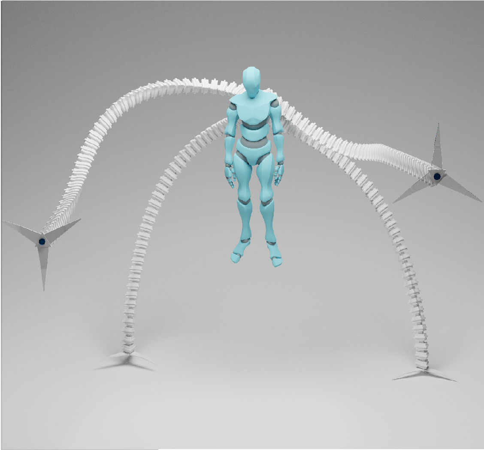
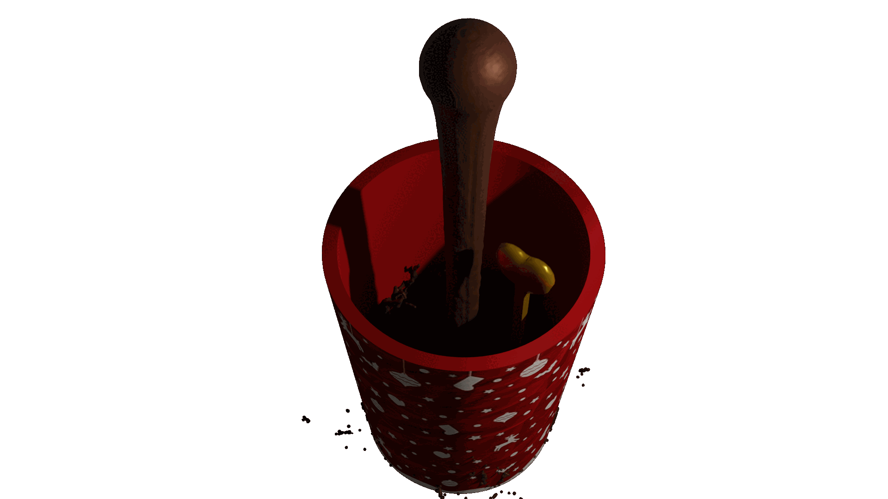
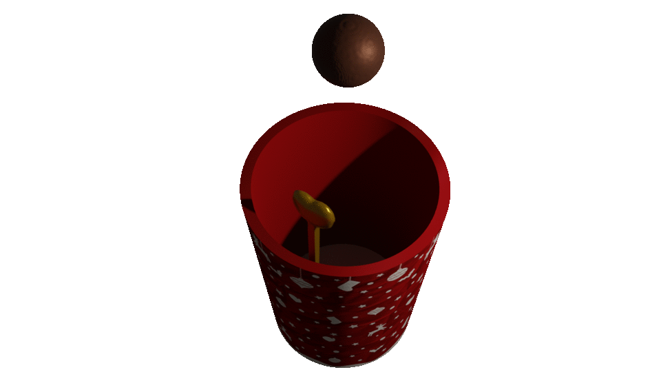
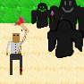

## Hi there 👋

  

 I am an indie developer on Unity, I know the basics of Python, 
 I work on Scratch for fun, I create something simple on Arduino.

 I participate in Brackeys Game Jam twice a year,
 at the end of the game jam I post the game on itch.io, and the source code on GitHub.

 I create some projects and games separately in order to learn something new,
 I publish some on GitHub, Yandex Games, Itch.io, YouTube, etc.

<!--# My works-->

## Images
   

  
  

 

  
  

## Games
     

  
  
  
  
  

  
  
  
  
  
  

    

    <table align="center">
    <tr border="none">
    <td width="50%" height="auto" align="left">   
 

        

     

</td>
    <td width="50%" align="center">
      
 

   
    
  
   
  
 
  </td>
</tr>
</table>

 

  
  
  
  
  

 

<picture>
  <source
    media="(prefers-color-scheme: dark)"
    srcset="https://raw.githubusercontent.com/platane/snk/output/github-contribution-grid-snake-dark.svg"
  />
  <source
    media="(prefers-color-scheme: light)"
    srcset="https://raw.githubusercontent.com/platane/snk/output/github-contribution-grid-snake.svg"
  />
  
</picture>

     
## Links:
 
 Itch.io - https://fly-up.itch.io/ 
 GitHub - https://github.com/flyupunity 
 Orcid - https://orcid.org/0009-0009-9570-4396 
 Scratch - https://scratch.mit.edu/users/flyspam/ 
 YouTube - https://www.youtube.com/@Flyupworking/ 
 Steam - https://steamcommunity.com/id/flyupworking/ 
 Yandex Games - https://yandex.ru/games/developer/67844 
 Amazon app store - https://www.amazon.com/s?i=mobileapps&rh=p_4%3AFlyupworking

<!--Я indie разработчик на Unity, знаю основу Python, по приколу работаю на Scratch, создаю что-то простое на Arduino.

 2 раза в год участвую в Brackeys Game Jam в конце геймджема я выкладываю игру на itch.io(https://fly-up.itch.io/), а исходный код на GitHub(https://github.com/flyupunity). 

Отдельно создаю некоторые проекты и игры для того чтобы научиться чему то новому, некоторые я публикую на GitHub, Yandex Games, Itch.io, YouTube и т.д.

Itch.io - https://fly-up.itch.io/
GitHub - https://github.com/flyupunity
Orcid - https://orcid.org/0009-0009-9570-4396
Scratch - https://scratch.mit.edu/users/flyspam/
YouTube - https://www.youtube.com/@Flyupworking/
Steam  - https://steamcommunity.com/id/flyupworking/
Yandex Games - https://yandex.ru/games/developer/67844
Amazon app store - https://www.amazon.com/s?i=mobileapps&rh=p_4%3AFlyupworking--!>

<!--
**flyupunity/flyupunity** is a ✨ _special_ ✨ repository because its `README.md` (this file) appears on your GitHub profile.

Here are some ideas to get you started:

- 🔭 I’m currently working on ...
- 🌱 I’m currently learning ...
- 👯 I’m looking to collaborate on ...
- 🤔 I’m looking for help with ...
- 💬 Ask me about ...
- 📫 How to reach me: ...
- 😄 Pronouns: ...
- ⚡ Fun fact: ...
-->
